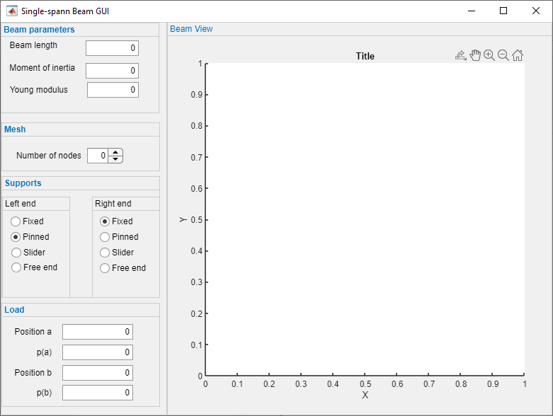

FEM analysis of single-span beams

The main index page for your project documentation goes here!

## About

FEAM analysis of single-span beams.

The view of initial version of SingleSpanBeam GUI:

## Requirements

TODO!

## Installation

TODO!

## Usage

TODO!

### Examples

TODO!

## Author

SingleSpanBeam is written and maintained by [Roman Putanowicz](https://github.com/putanowr). The project home page is <https://github.com/putanowr/SingleSpanBeam>.

## Acknowledgments

This project was created with [MatlabProjectTemplate](https://github.com/apjanke/MatlabProjectTemplate) by [Andrew Janke](https://apjanke.net).
